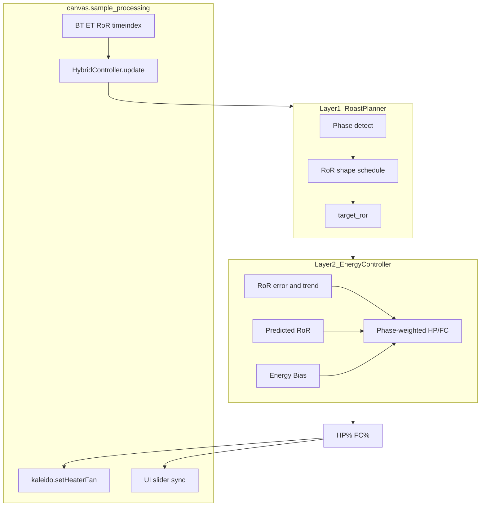
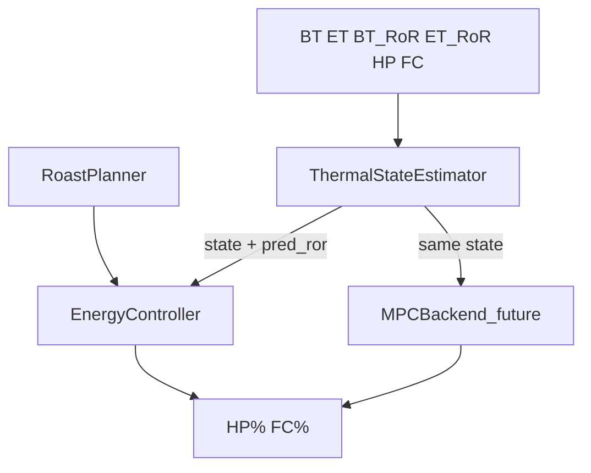
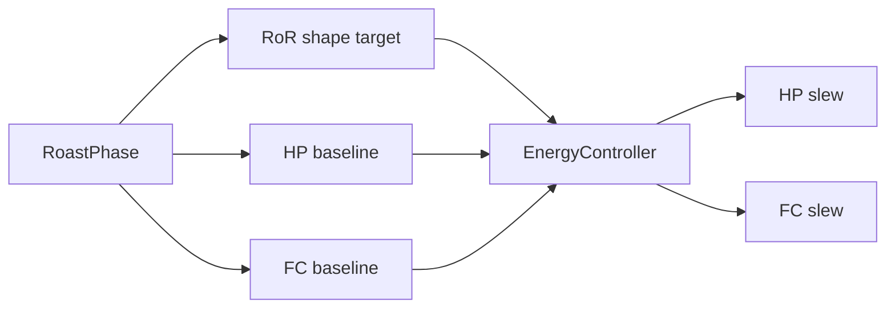

# Kaleido Hybrid Controller & MPC Specification

Status:

- **Layer 1 (Roast Planner) + Layer 1.5 (Thermal Twin) + Layer 2 (Energy Controller):** shipped in
  [`src/artisanlib/hybrid_controller.py`](../src/artisanlib/hybrid_controller.py)
- **Phase A (`ControllerBackend` / `hybridControlBackend`):** done — Energy default
- **Phase B (Lite MPC):** done —
  [`kaleido_model.py`](../src/artisanlib/kaleido_model.py),
  [`mpc_controller.py`](../src/artisanlib/mpc_controller.py)
  (enable via QSetting `hybridControlBackend=mpc`; Energy remains default + fallback)
- **Phase C (calibration):** done —
  [`kaleido_model_fit.py`](../src/artisanlib/kaleido_model_fit.py),
  [`scripts/fit_kaleido_model.py`](../scripts/fit_kaleido_model.py),
  fitted priors in [`docs/roasts/kaleido_model_m6.json`](roasts/kaleido_model_m6.json)
- **Phase D (event-aware horizon):** done — phase propagation + FC air-first cost scales in `MPCBackend`
- **Phase E (diagnostics/field):** done — Device Hybrid backend Energy|MPC, live `HybridDiagnostics`,
  [`scripts/compare_hybrid_backends.py`](../scripts/compare_hybrid_backends.py)

This is the **canonical** architecture and control-design document for Kaleido hybrid control in the
`artisan_kaleido` fork. It consolidates the M6 RoR-shape Hybrid playbook, the two-level energy
architecture, and the longer-term Model Predictive Control (MPC) backend.

**Log refinement (2026-07):** schedule priors and plant-response notes draw from **23** Artisan
`.alog` files under [`docs/roasts/`](roasts/) (~600 g Kaleido M6-class batches). Analysis helper:
[`docs/roasts/_analyze_m6_logs.py`](roasts/_analyze_m6_logs.py). Twin replay helper/tests live under
`src/test/unitary/artisanlib/`.

---

## Related code

| File | Role |
|------|------|
| `src/artisanlib/hybrid_controller.py` | `RoastPlanner`, `EnergyController`, `HybridController` facade |
| `src/artisanlib/kaleido_model.py` | Lite 3-state plant (`KaleidoModelParams`, `step`, `linearize`) |
| `src/artisanlib/mpc_controller.py` | `MPCBackend` horizon optimizer + Energy fallback |
| `src/artisanlib/canvas.py` | Sample-loop hook; CHARGE → Hybrid entry |
| `src/artisanlib/pid_control.py` | Hybrid mode (`externalPIDControl() == 5`) |
| `src/artisanlib/main.py` | `buildHybridControllerConfig` / QSettings |
| `src/artisanlib/kaleido.py` | HP/FC actuators via WebSocket/serial |
| `src/test/unitary/artisanlib/test_hybrid_controller.py` | Unit tests for planner / energy law |
| `src/test/unitary/artisanlib/test_mpc_controller.py` | Lite MPC plant + constraint + sim vs Energy |
| `docs/roasts/*.alog` | Operator corpus used to refine schedules / τ priors |

---

## 1. Project Goals

1. Improve roast consistency by controlling **Rate of Rise (RoR)** instead of Bean Temperature (BT).
2. Leverage **heater power and airflow together** as coordinated control variables.
3. Generalize across Kaleido models (M1, M2, M6, M10, …) via parameterization.
4. Evolve from rule-based control → predictive → adaptive as roast data accumulates.
5. Eventually replace reactive energy PID trim with **MPC** over a short horizon while keeping the
   same planner references and sample-loop interface.

---

## 2. Core Philosophy

Traditional profile following:

```text
Target BT → Power Adjustments → Bean Temperature
```

This project controls the roast **energy state**:

```text
Desired Roast Outcome
        ↓
Target RoR Profile        (Layer 1 — Roast Planner)
        ↓
Desired Energy State
        ↓
Power + Airflow           (Layer 2 — Energy Controller; future: MPC backend)
        ↓
Bean Temperature          (result, not primary target)
```

BT is used for **phase transitions**, **safety limits**, and **roast completion** — not as the
primary set-point.

### Primary / secondary variables

**Primary feedback:** RoR

**Secondary (continuous):** current RoR, target RoR, RoR error, RoR slope/acceleration, roast phase,
estimated Energy Bias, predicted RoR (horizon).

---

## 3. Design Principles

1. Control energy, not temperature.
2. RoR is the primary feedback variable.
3. Bean Temperature determines roast phase.
4. Airflow is a control input, not merely exhaust.
5. Favor many small adjustments over large corrections.
6. Use phase-dependent behavior rather than one global PID.
7. Predict future roast state whenever possible.
8. Maintain machine independence through parameterization.
9. Design for future adaptive / AI-assisted optimization.
10. Keep modules swappable so planners and energy laws evolve independently of `kaleido.py` I/O.

Mental model: **power ≈ acceleration**, **airflow ≈ damping**. Prefer many small air adjustments
over large heater cuts — especially after first crack.

---

## 4. Roast Phases

Phases are event-driven with BT fallbacks (no fixed timestamps as the primary detector):

```text
Charge → Turning Point → Dry End (Yellow) → Maillard
  → First Crack Start → Development → Drop
```

(Rolling first crack is treated as early Development once FCe is marked; otherwise FirstCrack
while FCs is set.)

**M6 charge reality (from logs):** charge BT/ET is typically **~180–210 °C** into a hot drum, then BT
falls to turning point (~1–2 min) before the rising roast that the RoR shape describes. Schedule
BT bounds and ET−BT targets therefore apply to the **rising segment after TP**, not the charge
instant. Phase detectors that key only on absolute BT ≥ 150 without a TP context will mis-label
the post-charge plunge.

### Phase control priorities

| Phase | Goal | Actuator priority |
|-------|------|-------------------|
| Drying | Add energy; avoid stalls | Heater dominates; low air; slow corrections |
| Maillard | Smooth declining RoR | Gradual heater cuts; moderate air |
| First Crack | No crash / no flick | Air primary; tiny heater moves |
| Development | Controlled finish | Mostly air; minimal heater; avoid oscillation |

---

## 5. Current Architecture (Shipped Baseline)



**Control flow each sample (1 Hz typical):**

1. Read BT, ET; compute RoR and RoR acceleration
2. Detect roast phase (`detect_roast_phase` — events + BT fallbacks)
3. Compute `ror_target` from the built-in **shape schedule** (`interpolate_ror_target`)
4. `EnergyController` produces `(HP, FC)` from baselines + trend/predictive trim + Energy Bias
5. Send to Kaleido via `setHeaterFan(hp, fc)`

Background profiles are **not** used for Hybrid RoR control. They remain useful for **visual
comparison / timing alignment** only.

### CHARGE / mode gating

Hybrid is intentionally **phased** so Machine PID owns drum warmup and Hybrid owns the roast after beans drop:

| Stage | Control | Protocol |
|-------|---------|----------|
| ON / set SV | Monitoring only | Operator sets warmup temperature |
| Start Heating (or CONTROL / PIDon pre-CHARGE) | **Machine PID warmup** | Heaters on (`HS`); `AH=1`, SV → `TS` |
| START | Recording only | Roaster control unchanged (still Machine PID if already warming) |
| CHARGE (or auto-detect) | **Hybrid** | `AH=0`; drive HP + FC from the M6 RoR-shape plan + Energy layer (+ twin) |
| CONTROL / PIDon after CHARGE | Hybrid | Same Hybrid path as CHARGE entry |

- With Hybrid mode selected, **CHARGE always enters Hybrid** (no loaded background required).
- Background profiles remain optional for **visual comparison / timing alignment** only.
- Manual remains available when Hybrid mode is off, Control is off, or the user calls `pidOff`.

### Implementation map

| Concept | Code |
|---------|------|
| Planner | `RoastPlanner` |
| Thermal twin (Layer 1.5) | `ThermalStateEstimator` |
| Energy Bias (derived) | scalar from twin states (legacy `EnergyBiasEstimator` API kept thin) |
| Energy layer | `EnergyController` |
| Facade for Artisan sample loop | `HybridController` |
| Machine params | `MachineCharacteristics` |

---

## 5A. Thermal Digital Twin (Layer 1.5)

The novel control idea: estimate the roaster’s **internal energy state**, then use that estimate to
anticipate RoR—rather than reacting only to instantaneous RoR error.

```text
Measured: BT, ET, BT_RoR, ET_RoR, HP, FC
        ↓
Twin:     E_air, E_drum, E_beans, Moisture   (+ derived pred_ror, energy_bias)
        ↓
Controller: Power + Air   (Energy layer now; MPC later on the same state)
```



### Twin state (v1)

| State | Proxy from measurements | Role |
|-------|-------------------------|------|
| `E_air` | ET, ET−BT, ET_RoR, FC | Fast chamber energy / damping |
| `E_drum` | Lagged HP (τ ≈ `heater_response_delay_s`, ~25 s) | Stored heater/body energy still arriving |
| `E_beans` | BT_RoR + transfer from air/drum | Bean thermal inertia |
| `Moisture` | Phase-timed leak + RoR undershoot | Endothermic drying load (heuristic) |

```text
pred_ror ≈ f(E_beans, E_air, E_drum, Moisture, phase)
energy_bias ≈ weighted(E_drum, E_air, E_beans, -Moisture)   # feeds existing bias air / HP authority
```

Quality bar: open-loop **15–30 s BT RoR prediction RMSE** on `docs/roasts/*.alog` must beat
accel-only linear extrapolation before raising twin influence on HP/FC (`twin_pred_blend`).

Sensing caveats (§6A) still apply: BT probe contact noise; do not treat 1–3 s BT spikes as process.

Lite MPC must **reuse** twin / plant equations—no second competing model.

---

## 6. M6 Phase Schedule (600g medium/light)

**Log-refined** defaults from the 23-roast corpus are the design intent and the values coded in
`hybrid_controller.py`. The earlier “shipped vs refined” tables below record how those numbers were
chosen.

Corpus notes: weights ≈ 600 g; DROP ≈ 190–205 °C; roast length CHARGE→DROP ≈ 8–11 min; FCs BT
cluster ≈ 178–188 °C. Stats use post-TP rising phases; RoR is a 30 s BT window (°C/min).

### 6.1 RoR shape (°C/min)

Interpolate within phase by BT between phase entry/exit bounds.

| Phase | Shipped start→end | Log-refined start→end | Post AB_TEST_1 | Evidence (corpus) |
|-------|-------------------|----------------------|----------------|-------------------|
| Charge (post-TP peak) | 22 → 22 | 22 → 22 | 22 → 22 | BT 90–110 median RoR ≈ 21–22 |
| Drying | 22 → 16 (BT 100–150) | **22 → 15.5** | 22 → 15.5 | Phase start/end medians ≈ 18.6 → 15.6; BT-bin at 140–150 ≈ 15.4 |
| Yellow | 16 → 14 (150–170) | **15 → 14** | 15 → 14 | Phase ≈ 15.2 → 14.3; BT-bin 150–170 ≈ 14.7 → 14.0 |
| Maillard | 12 → 10 (170–195) | **14 → 10** | 14 → 10 | Phase ≈ 14.3 → 12.0 into FCs; BT-bin 170–190 ≈ 13.0 → 10.3 |
| FirstCrack | 8.5 → 8.5 | 11 → 9 | **10 → 7** (BT 180–195) | Field AB: flatter post-FC RoR compressed development; steeper target + soft-brake |
| Development | 8 → 5.5 | 9 → 5.5 | **7 → 3.5** | Auto-enter Dev after FCs once BT ≥ 190 even without FCe |

BT-bin median RoR curve (CHARGE→DROP pooled, all 23 logs):

| BT (°C) | 90 | 100 | 110 | 120 | 130 | 140 | 150 | 160 | 170 | 180 | 190 |
|---------|----|-----|-----|-----|-----|-----|-----|-----|-----|-----|-----|
| RoR med | 22.0 | 21.6 | 20.2 | 18.4 | 16.8 | 15.4 | 14.7 | 14.0 | 13.0 | 10.3 | 6.2 |

### 6.2 HP / FC baselines (%)

| Phase | Shipped HP / FC | Log median HP / FC | Log-refined HP / FC | Post AB_TEST_1 | Notes |
|-------|-----------------|--------------------|---------------------|----------------|-------|
| Drying (post-TP) | 85 / 30 | 90 / 30 | **90 / 30** | 90 / 30 | Early heat often 90–100 |
| Yellow | 80 / 40 | 85 / 30 | **85 / 35** | 85 / 35 | Keep FC low through yellow |
| Maillard | 70 / 55 | 80 / 40 | **80 / 40** | 80 / 40 | Shipped FC 55 was aggressive vs logs |
| FirstCrack | 60 / 65 | 50 / 40 | 50 / 50 | **40 / 60** | Harder HP cut + more air after FC |
| Development | 50 / 75 | 40 / 50 | 40 / 55 | **25 / 70** | Soft-brake FC trim still allowed to ~80–100 |
| Cooling | 0 / 80 | — | 0 / 80 | 0 / 80 | unchanged |

Operator style varies after FCs (some drop HP to 0 and spike FC to 100; others ride 40/50). Baseline
should sit near the median; crash/flick and ET−BT trims supply the soft-brake authority.

### 6.3 ET−BT offset targets (°C)

| Phase | Shipped | Log median (rising) | Log-refined | Notes |
|-------|---------|---------------------|-------------|-------|
| Drying | 60 | ~96 | **soft / high or de-weighted** | Hot-drum charge leaves ET ≫ BT; chasing 60 would slam FC |
| Yellow | 50 | ~67 | **65** | |
| Maillard | 45 | ~47 | **45** | Good match |
| FirstCrack | 35 | ~29 | **30** | |
| Development | 28 | ~4 | **10** | Offset often collapses; 28 fights the real finish |
| Cooling | 25 | — | 25 | |

Until phase-aware weighting lands, prefer **low fan-PID authority in drying** over a hard 60 °C
early offset target.

### 6.4 Phase heater weight (RoR correction split)

Fraction of RoR correction applied to heater (remainder → air). Unchanged for now; logs support
heater-heavy early / air-heavy late:

| Phase | Heater weight |
|-------|---------------|
| Charge / Drying | 0.85 |
| Yellow | 0.70 |
| Maillard | 0.45 |
| FirstCrack | 0.20 |
| Development | 0.15 |

---

## 6A. Plant response and sensing (from M6 logs)

### Actuator → process delays

Isolated **held** HP steps (|ΔHP| ≥ 15 %, hold ≥ 20 s, FC approximately stable) across the corpus:

| Observation | Typical | Implication |
|-------------|---------|-------------|
| ET half-rise after HP step | **~25–30 s** (median ≈ 25.5 s, n≈16) | Chamber / element energy is slow; do not credit HP trim within a few seconds |
| RoR half-response (30 s RoR window) | **~25–35 s** after the step | Effective HP→RoR decision delay **≈ 20–40 s**; matches predictive horizon (~25 s) |
| Instant 1–3 s “ET/RoR moved” detections | Common but unreliable | Often probe noise or concurrent drift — not true plant τ |
| FC → ET−BT | Fast (seconds) when measurable | Air damps / vents chamber quickly; prefer FC for near-term correction |
| Clean isolated FC steps | Rare in manual logs | Soft-brake behavior inferred more from end-of-roast trajectories than step tests |

**MachineCharacteristics (shipped vs recommended):**

| Param | Shipped | Log-informed recommend |
|-------|---------|------------------------|
| `heater_response_delay_s` | 4.0 | **20–30** |
| `airflow_response_delay_s` | 8.0 | **3–8** (ET−BT fast; RoR still slower) |
| `heater_slew_pct_per_sec` | 5.0 | Keep ≤ 5 — large HP swings fight the lag |
| `ror_predict_horizon_s` | 25.0 | Keep ~25–35 (aligned with observed half-rise) |

MPC Lite model time constants (§11.4) should be seeded from these lags (`tau_chamber` ~25 s is
already in the right ballpark; `tau_element` ~8 s may be slightly fast vs ET half-rise).

### BT probe variability

The bean probe sees a **moving mass**: contact quality varies, so high-frequency BT is not ground
truth.

| Metric (CHARGE→DROP, residual vs 11-sample MA) | Typical |
|-----------------------------------------------|---------|
| Absolute residual MAD | ≈ **0.16 °C** |
| Residual RMS | ≈ **0.25 °C** |
| Fraction \|residual\| > 0.8 °C | ≈ **0–2 %** of samples |

Control implications:

1. Never chase raw 1 Hz BT; control on **smoothed RoR** (already ~30 s) and phase.
2. Treat sudden BT spikes/dips as sensing, not process — **reject or mute** accel/crash logic for
   a few seconds after large residuals.
3. Prefer **ET and ET−BT** for fast energy feedback; use BT mainly for phase and long-horizon RoR.
4. RoR error deadbands of ~0.5–1.0 °C/min are appropriate relative to probe noise.

---

## 7. M6 Playbook → Control Mechanisms

| M6 playbook | Controller mechanism |
|-------------|---------------------|
| Declining RoR (≈22→15→10→6) | Phase RoR **shape schedule** refined from `docs/roasts` BT-bin curve |
| Power schedule (90 → 80 → 50 → 40) | Phase **HP baseline** + modest RoR PID trim (±`heater_trim_limit`) |
| Air rises modestly; soft-brake after FC | Phase **FC baseline** ~30→55 + ET−BT / crash / flick trim (authority to ~100) |
| Prefer air over hard power cuts at FC | Low phase heater weight; HP lag 20–40 s → avoid late HP thrash |
| Crash / flick prevention | Crash: boost FC when RoR undershoots; flick: extra FC on positive RoR accel |



---

## 8. Layer 1 — Roast Planner

Produces desired RoR only (machine-independent schedule).

Current implementation:

1. `detect_roast_phase(timeindex, bt, config)`
2. `interpolate_ror_target(bt, phase, config)` from `ror_shape` + `ror_bt_bounds`

No background ΔBT lookup. Background remains optional for the operator’s visual guide.

---

## 9. Layer 2 — Energy Controller

Inputs: target RoR, current RoR, RoR accel/trend, phase, Energy Bias, machine characteristics.

Outputs: Heater %, Airflow % (drum reserved for later).

### High-level law

```text
hp_raw = hp_baseline(phase) + heater_trim   # trim clamped, phase-weighted
fc_raw = fc_baseline(phase) + fan_offset_pid + air_ror_trim
         + crash_flick_trim + energy_bias_air
```

Then apply slew limits (heater slow, fan faster) and clamp 0–100.

### Trend-aware correction

Do not act on instantaneous error alone:

- Error high but RoR already declining smoothly toward target → scale corrections down
  (`declining_error_scale`)
- Error high and RoR accelerating away from target → intervene (prefer air when past Maillard)

### Predictive RoR

Blend of:

1. **Accel-only:** `current_ror + ror_accel * horizon_s`
2. **Twin:** `ThermalStateEstimator.pred_ror` from Layer 1.5 states

```text
effective_pred = (1 - twin_pred_blend) * accel_pred + twin_pred_blend * twin_pred
effective_ror  = (1 - predict_blend) * current_ror + predict_blend * effective_pred
```

Horizon default ~30 s (aligned with observed HP→RoR half-rise). Twin blend starts modest and is
raised only after replay RMSE clears the accel-only gate (§5A).

### Energy Bias (derived from twin)

Scalar `energy_bias` is derived from twin states (drum/air/beans − moisture). Legacy actuator-only
integrator remains available as a fallback. High bias approaching First Crack → preemptive airflow
and restrained heater trim authority.

### Crash / flick

- **Flick:** positive RoR accel above threshold → extra FC (stronger near First Crack)
- **Crash:** if `ror < ror_target - margin` in FC/Development → add FC (air first, not HP)

### Machine characteristics

Per-model parameters (delays, gains, thermal mass) scale actuator influence without changing the
algorithm. Defaults are Kaleido-generic; **M6 log refinement** says heater→RoR delay is **~20–40 s**,
not 4 s — update `MachineCharacteristics` / M6 preset accordingly (§6A). M10 and others still need
their own presets.

---

## 10. MPC Problem Statement (Future Layer 3)

Kaleido roasters are **hybrid electric/convection systems**. Heater power supplies energy; airflow
changes how efficiently that energy reaches the beans. Shipped Hybrid uses Layer 1 + Layer 2
(baselines + trend/predictive PID trims). MPC replaces the reactive energy-layer optimizer with
**predictive coordination**: each sample, simulate the next 30–60 seconds, choose HP/FC sequences
that best satisfy RoR and offset targets while respecting actuator limits.

**Delivery phases:**

1. **Lite MPC** — lumped linear model, `scipy` solver, simulated-plant tests
2. **Calibrated MPC** — parameters fit from Kaleido step-response / roast logs
3. **Production MPC** — event-aware references, diagnostics UI, field validation

Estimated effort from a refined spec to production-trustworthy MPC: **6–10 weeks** (one developer,
includes on-machine tuning).

### 10.1 Actuator roles

| Actuator | Tag | Primary responsibility | Target time constant |
|----------|-----|------------------------|----------------------|
| Heater | HP | System energy; long-term RoR trend | 10–20 s |
| Fan | FC | Heat transfer efficiency; ET−BT offset | 2–5 s |

### 10.2 Objectives

1. Track desired RoR profile from the **shape schedule** (same Layer 1 planner as Hybrid)
2. Maintain phase-appropriate ET−BT offset (chamber energy buffer)
3. Minimize RoR oscillation and positive RoR acceleration (overshoot / flick)
4. Minimize unnecessary HP/FC movement (smooth actuation)
5. Prefer air corrections after first crack (encode via weights / move blocking)

### 10.3 Cost function

Per-step cost over prediction horizon `N`:

```text
J = Σ_k [ w_ror   * (RoR[k] - RoR_ref[k])²
         + w_accel * (ΔRoR[k])²
         + w_dhp   * (ΔHP[k])²
         + w_dfc   * (ΔFC[k])²
         + w_offset * (ET[k] - BT[k] - offset_ref[k])² ]
```

Suggested default weights (to be tuned):

| Weight | Default | Notes |
|--------|---------|-------|
| `w_ror` | 3.0 | Primary tracking |
| `w_accel` | 2.0 | Dampens overshoot / first-crack runaway |
| `w_dhp` | 0.5 | Heater movement penalty |
| `w_dfc` | 0.5 | Fan movement penalty |
| `w_offset` | 1.0 | ET−BT phase schedule |

Align initial values with existing `HybridControllerConfig` keys in `main.py` where applicable.

---

## 11. Thermal Model

### 11.1 Physical basis (four thermal masses)

| Mass | Response | Role in model |
|------|----------|---------------|
| Heating elements | seconds | Slow energy storage `E_element` |
| Air | near-instant | Collapsed into chamber for Lite MPC |
| Drum / chamber | tens of seconds | `T_chamber` (ET proxy) |
| Bean mass | minutes | `T_bean` (BT) |

### 11.2 State vector (Lite MPC — 3 states)

```text
x = [ T_bean, T_chamber, E_element ]ᵀ
u = [ u_hp, u_fc ]ᵀ          # both in [0, 100]
```

**Continuous-time intuition:**

```text
dE_element/dt = (K_hp * u_hp - E_element) / τ_element
dT_chamber/dt = (K_ec * E_element - K_loss * (T_chamber - T_amb) - Q_transfer) / τ_chamber
dT_bean/dt    = (Q_transfer - K_beans * (T_bean - T_amb)) / τ_bean

Q_transfer = k_fc(u_fc) * (T_chamber - T_bean)
k_fc(u_fc) = k_fc0 + k_fc1 * (u_fc / 100)    # fan increases transfer
```

**First-crack exotherm (Tier 2):**

```text
Q_exo = Q_fc_max * exp(-((T_bean - T_fc) / σ)²)   when phase >= FirstCrack
```

Added to `dT_bean/dt` as positive heat source.

### 11.3 Discrete-time linearized form

For Lite MPC, Euler discretization at `dt`:

```text
x[k+1] = A x[k] + B u[k]
y[k]   = C x[k]
```

Where outputs `y = [T_bean, T_chamber, RoR]` and `RoR[k] ≈ (T_bean[k] - T_bean[k-1]) / dt`.

RoR is **derived**, not a separate state — computed from predicted BT trajectory inside the cost.

### 11.4 Model parameters (`KaleidoModelParams`)

Planned dataclass (defaults are placeholders until calibration from M6 logs / step tests):

| Parameter | Symbol | Default | Unit |
|-----------|--------|---------|------|
| Element time constant | `tau_element` | 8.0 → prefer **12–20** | s | Seed from §6A ET half-rise |
| Chamber time constant | `tau_chamber` | 25.0 | s | Matches observed ~25–30 s ET half-rise |
| Bean time constant | `tau_bean` | 120.0 | s |
| HP gain | `K_hp` | 1.0 | — |
| Element→chamber gain | `K_ec` | 0.8 | — |
| Chamber loss | `K_loss` | 0.05 | — |
| Base transfer coeff | `k_fc0` | 0.02 | — |
| Fan transfer gain | `k_fc1` | 0.06 | — |
| Bean loss | `K_beans` | 0.01 | — |
| Ambient temp | `T_amb` | 25.0 | °C |

Stored in QSettings / `.aset` as flat keys or JSON blob `kaleidoModelParams`.

---

## 12. MPC Formulation

### 12.1 Horizon and timing

| Parameter | Value | Rationale |
|-----------|-------|-----------|
| Horizon `N` | 30–60 steps | 30–60 s lookahead at 1 Hz |
| Sample `dt` | 1.0 s | Matches Artisan sample interval |
| Move blocking | Optional 5 s | Reduces DOF; HP changes every 5 s, FC every 1–2 s |

### 12.2 Decision variables

```text
U = { HP[k], HP[k+1], …, HP[k+N-1], FC[k], …, FC[k+N-1] }
```

With move blocking, HP is parameterized by `N/5` values held constant over 5 s blocks.

### 12.3 Constraints (hard)

```text
0 ≤ HP[k] ≤ 100
0 ≤ FC[k] ≤ 100
|HP[k] - HP[k-1]| ≤ slew_hp * dt     # default slew_hp = 5 %/s
|FC[k] - FC[k-1]| ≤ slew_fc * dt     # default slew_fc = 20 %/s
```

Initial `HP[k-1]`, `FC[k-1]` from last commanded values.

### 12.4 Reference trajectory over horizon

**RoR reference** (`RoR_ref[k..k+N-1]`) — primary:

- Advance predicted BT along the same **shape schedule** used by Layer 1
- `RoR_ref[k] = interpolate_ror_target(BT_pred[k], phase_pred[k], config)`
- Phase prediction uses event markers when known; otherwise BT thresholds

**Optional Tier 2 / operator-assist (not required for Hybrid parity):**

- Overlay or blend a background ΔBT horizon for visual-style following when the user wants a
  specific prior roast as the reference (Align = ALL recommended)
- Background remains non-primary for the shipped Hybrid path

**ET−BT offset reference** (`offset_ref[k]`):

- From phase schedule (`HybridControllerConfig.et_bt_offsets`) based on predicted phase

**Baseline fan / heater feedforward** (optional in cost):

- Phase baselines as soft bias so MPC inherits the M6 playbook without locking outputs

### 12.5 Receding horizon

Standard MPC loop each sample:

1. Measure / estimate current state (BT, ET, HP, FC history)
2. Solve for optimal `U*`
3. Apply `HP[k]`, `FC[k]` (first step only)
4. Shift horizon; warm-start from previous `U*`; repeat

---

## 13. State Estimation

MPC needs full state `x[k]`; only BT and ET are measured.

**Lite approach:** Use measured BT, ET directly as `T_bean`, `T_chamber`; initialize
`E_element` from recent HP history:

```text
E_element ≈ K_hp * mean(HP over last tau_element seconds)
```

**Tier 2:** Kalman filter on linear model, tuned from calibration data. Energy Bias from Layer 2
may seed heater/air energy terms but is not a plant state by itself.

---

## 14. Solver Strategy

MPC runs in `canvas.sample_processing()` on the **GUI thread**. Solver must complete in **< 50 ms**
(Lite) or **< 20 ms** (Standard) per tick.

| Tier | Method | Dependency | Notes |
|------|--------|------------|-------|
| **Lite** | Coarse grid search on `(HP₀, FC₀)` + short FC sequence; or `scipy.optimize.minimize` on reduced DOF | `scipy` (already in `requirements.txt`) | Ship first |
| **Standard** | Condensed QP (linear model) | Optional `cvxpy` | Faster, smoother |
| **Advanced** | Nonlinear MPC | Optional `casadi` / `acados` | Only if Lite insufficient |

**Fallback:** If solver exceeds time budget or fails to converge, fall back to the shipped
EnergyController (Layer 2) for that tick and log a warning. Never block the GUI thread
indefinitely.

---

## 15. Software Architecture (Planned for MPC)

### 15.1 Backend protocol

**Phase A status: done.** `ControllerBackend` Protocol, `create_controller_backend()`, and
QSetting `hybridControlBackend` (`"energy"` default) are in
[`hybrid_controller.py`](../src/artisanlib/hybrid_controller.py) / `main.py`.

**Phase B status: done.** Lite plant
[`kaleido_model.py`](../src/artisanlib/kaleido_model.py) and
[`mpc_controller.py`](../src/artisanlib/mpc_controller.py) (`MPCBackend`).
Requesting `"mpc"` returns the horizon optimizer; solver timeout/failure falls back to Energy
for that tick. Sample loop still calls `hybrid_controller.update(...)`.

Refactor without breaking the sample-loop call site:

```python
# src/artisanlib/hybrid_controller.py (future)

class ControllerBackend(Protocol):
    active: bool

    def reset(self) -> None: ...
    def activate(self) -> None: ...
    def update(
        self,
        bt: float,
        et: float,
        ror: float | None,
        ror_accel: float,
        timeindex: list[int],
        now: float,
    ) -> tuple[int, int]: ...


class PIDEnergyBackend:
    """Current EnergyController / HybridController logic."""


class MPCBackend:
    """Horizon optimizer using kaleido_model + mpc_controller."""
```

Note: `bg_ror_target` is **not** part of the primary API. RoR reference comes from Layer 1
(`RoastPlanner`). An optional background horizon helper may be passed for Tier-2 blends only.

### 15.2 New modules (future)

| File | Responsibility |
|------|----------------|
| `src/artisanlib/kaleido_model.py` | `KaleidoModelParams`, `step()`, linearize |
| `src/artisanlib/mpc_controller.py` | Cost, constraints, solver, `MPCBackend` |
| `src/test/unitary/artisanlib/test_mpc_controller.py` | Sim plant, constraint tests |
| `scripts/fit_kaleido_model.py` (optional) | Offline parameter fit from logs |

### 15.3 Settings keys (future)

| Key | Type | Default |
|-----|------|---------|
| `hybridControlBackend` | `"energy"` \| `"mpc"` | `"energy"` |
| `mpcHorizon` | int | 45 |
| `mpcDt` | float | 1.0 |
| `mpcWRor` | float | 3.0 |
| `mpcWAccel` | float | 2.0 |
| `mpcWDhp` | float | 0.5 |
| `mpcWDfc` | float | 0.5 |
| `mpcWOffset` | float | 1.0 |
| `mpcSolverTimeoutMs` | int | 50 |
| `kaleidoModelParams` | JSON | defaults from §11.4 |

### 15.4 UI (future)

- Extend **Kaleido Control** selector: Energy (Hybrid) / **MPC** / Machine PID
- Or sub-option under Hybrid: Backend = Energy | MPC
- Diagnostics extra curves: predicted BT, predicted RoR, commanded vs applied HP/FC

---

## 16. Background Profiles (Non-Control Role)

| Setting | Effect for Hybrid / MPC |
|---------|-------------------------|
| Background loaded | Visual comparison and timing guide only for Hybrid energy control |
| **Align = CHARGE** | Background time axis indexed by seconds since CHARGE |
| **Align = ALL** | Event marks shift background `timeB`; useful if a Tier-2 blend uses background RoR |

**Recommendation if using Tier-2 background blend:** set **Roast → Background → Align = ALL** and
mark events when they occur.

Shipped Hybrid does **not** require a background profile to enter control at CHARGE.

---

## 17. System Identification and Calibration

Before MPC outperforms tuned Layer 2, model parameters must be fit to the specific Kaleido unit.
Schedule defaults should also be refined from successful M6 logs before locking MPC weights.

### 17.1 Step-response tests (manual)

Record a roast or monitoring session with PID/Hybrid off:

1. **HP step:** FC fixed at 40%; step HP 40 → 60 → 40; hold 60 s each
2. **FC step:** HP fixed at 50%; step FC 30 → 50 → 30; hold 60 s each
3. Log BT, ET, HP, FC at 1 Hz (Artisan `.alog` or Kaleido CSV export)

### 17.2 Parameter extraction

| Parameter | Method |
|-----------|--------|
| `tau_element`, `K_hp` | Fit E_element proxy from ET response to HP step |
| `tau_chamber`, `K_ec` | ET rise time to HP step |
| `tau_bean` | BT rise time |
| `k_fc0`, `k_fc1` | ET−BT decay rate vs FC during HP hold |
| `Q_exo` | BT spike magnitude at first crack (Tier 2) |

### 17.3 Validation / schedule data

- Existing sanity fixtures: `src/test/sanity/data/kaleido/*.csv`
- Operator corpus: `docs/roasts/*.alog` (23× ~600 g; schedule + τ priors in §6 / §6A)
- Replay BT/ET/HP/FC through open-loop model; minimize prediction error over full roast

### 17.4 Optional offline tool

`scripts/fit_kaleido_model.py`:

```text
python scripts/fit_kaleido_model.py --input roast.alog --output model.json
```

Not part of initial MPC implementation; specified for Phase C.

---

## 18. Roadmap

| Stage | Status |
|-------|--------|
| M6 RoR-shape planner + energy Layer 2 | **Done** |
| Planner / Energy split, Energy Bias, predictive RoR, phase actuator bias | **Done** |
| Refine schedule / priors from M6 `.alog` corpus | **Done** (documented §6 / §6A) |
| Apply log-refined defaults + heater delay in code / tests | **Done** |
| Thermal digital twin Layer 1.5 (Tier 1 heuristics) | **Done** |
| Twin replay gate + raise `twin_pred_blend` | **Done** (corpus RMSE gate in tests) |
| **A** — `ControllerBackend` protocol; MPC stub delegates to Energy | **Done** |
| **B** — Lite MPC + sim plant + unit tests | **Done** |
| **C** — Model calibration from logs | **Done** (23× `.alog`; see `kaleido_model_m6.json`) |
| **D** — Event-aware horizon reference polish | **Done** |
| **E** — Diagnostics UI + field A/B tuning | **Done** |
| Machine profile YAML / UI presets (M1–M10) | Planned |
| Twin Tier 2 + shared Lite MPC plant | Planned |
| Learned thermal response / auto gains | Future |
| Historical-roast ML optimization | Future |

| MPC phase | Scope | Exit criteria |
|-----------|-------|---------------|
| **0** | Spec consolidated + log-refined | Doc reviewed; schedule numbers trusted (§6) |
| **A** | Backend protocol; stub → Energy | **Done** — `create_controller_backend` / `hybridControlBackend` |
| **B** | Lite MPC + sim plant | **Done** — sim criterion + Energy timeout fallback |
| **C** | Calibration from logs | **Done** — corpus fit; ET 15s RMSE 11.4→2.3 °C |
| **D** | Event-aware horizon | **Done** — event+BT phase; FC air-first weights |
| **E** | Diagnostics + field A/B | **Done** — Device backend selector + offline A/B script |

---

## 19. Testing Strategy

### 19.1 Hybrid (shipped)

[`test_hybrid_controller.py`](../src/test/unitary/artisanlib/test_hybrid_controller.py):

- RoR target declines across phases / BT
- HP output near baseline with PID trim bounded
- Crash path increases FC when RoR undershoots post-FC
- Update path does not depend on background RoR

### 19.2 MPC unit tests (`test_mpc_controller.py`)

[`test_mpc_controller.py`](../src/test/unitary/artisanlib/test_mpc_controller.py):

- Simulated plant: model step / transfer directionality
- Constraints: output never exceeds 0–100; slew limits respected
- Solver timeout: verify fallback to Energy backend
- Closed-loop: MPC RoR RMSE beats Energy on the shared Lite plant

### 19.3 Replay tests

- Feed recorded BT/ET/HP/FC from sanity CSVs and `docs/roasts/*.alog`
- Open-loop: compare one-step-ahead predictions to measured BT/ET
- Report RMSE vs calibrated and default parameters

### 19.4 Integration / field

- Mock `KaleidoPort`; verify `sample_processing` calls MPC when backend=`mpc`
- Verify HP/FC not double-commanded by Energy and MPC simultaneously
- Field A/B: same bean lot; Energy vs MPC; compare RoR RMSE vs schedule, max RoR, actuator travel

---

## 20. Risks and Mitigations

| Risk | Impact | Mitigation |
|------|--------|------------|
| Wrong model parameters | Poor or unstable control | Calibration phase; Energy fallback |
| Schedule defaults not M6-realistic | MPC/Energy fight operator intent | Log-refined §6; apply in code before Phase B |
| Ignoring HP lag / probing BT spikes | Oscillation / false crash-flick | §6A delays; mute accel on BT residuals |
| GUI thread latency | UI stutter | Bounded solver; move blocking; timeout fallback |
| First-crack exotherm | RoR overshoot / flick | Exo term in model; high `w_accel` near FCs; air-first weights |
| User marks events late | Phase / reference drift | BT-based phase fallback (already in planner) |
| No RC in model | Minor drift | Out of scope v1; document limitation |

---

## 21. Out of Scope (v1)

- Drum speed (RC) as third actuator
- Full schedule editor UI / espresso-vs-filter presets (defaults are medium/light 600g)
- Auto-tuning / ML-based model library
- Forcing Machine / Software PID modes to use the shape plan
- Machine PID (`AH`/`TS`) coordination — Hybrid/MPC require `AH=0`, same as today

---

## 22. References

- Shipped Hybrid: `src/artisanlib/hybrid_controller.py`
- Background alignment helpers: `canvas.timealign()`, `alignEvent` in Background dialog
- Kaleido protocol: `src/artisanlib/kaleido.py` (HP, FC tags)
- SciPy optimization: https://docs.scipy.org/doc/scipy/reference/optimize.html
- M6 roast log corpus + analysis: `docs/roasts/`, `docs/roasts/_analyze_m6_logs.py`

---

## Appendix A: Sample-loop pseudocode (MPC)

```python
# canvas.sample_processing() — future MPC path

if hybrid_active and backend == "mpc":
    phase = detect_roast_phase(timeindex, bt, config)
    # Horizon RoR refs from shape schedule (predicted BT/phase), not background ΔBT
    ror_ref_horizon = [
        interpolate_ror_target(bt_pred[k], phase_pred[k], config)
        for k in range(mpc_horizon)
    ]
    hp, fc = mpc_backend.update(
        bt=st2, et=st1, ror=rateofchange2plot,
        ror_accel=ror_accel, timeindex=timeindex,
        now=tx,
        # planner refs computed inside backend or passed explicitly
    )
    kaleido.setHeaterFan(hp, fc)
```

If the solver fails or times out: call the EnergyController path for that tick.

---

## Appendix B: Default phase schedules (canonical)

**Design intent = log-refined** (§6), now coded in `hybrid_controller.py`.

| Phase | ET−BT (°C) | HP % | FC % | RoR shape (°C/min) |
|-------|------------|------|------|--------------------|
| Drying (post-TP) | 85 (PID de-weighted) | 90 | 30 | 22 → 15.5 |
| Yellow | 65 | 85 | 35 | 15 → 14 |
| Maillard | 45 | 80 | 40 | 14 → 10 |
| FirstCrack | 30 | 40 | 60 | 10 → 7 |
| Development | 10 | 25 | 70 (trim to 80–100 OK) | 7 → 3.5 |
| Cooling | 25 | 0 | 80 | 0 |

Used by Layer 2 feedforward / offset PID today, and by MPC offset cost + optional baseline bias later.
