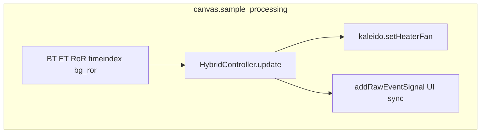

# Kaleido Hybrid Controller — MPC Design Specification

Status: **Design / planning** (not yet implemented)

This document specifies Model Predictive Control (MPC) for Kaleido hybrid roasters in the
`artisan_kaleido` fork. It extends the shipped dual-PID Hybrid Controller MVP with horizon-based
optimization over coordinated heater (HP) and fan (FC) actuators.

Related code (current MVP):

| File | Role |
|------|------|
| `src/artisanlib/hybrid_controller.py` | Dual-PID backend; `update()` swap target |
| `src/artisanlib/canvas.py` (~5119) | Sample-loop hook |
| `src/artisanlib/pid_control.py` | Hybrid mode (`externalPIDControl() == 5`) |
| `src/artisanlib/kaleido.py` | HP/FC actuators via WebSocket/serial |

---

## 1. Executive Summary

Kaleido roasters are **hybrid electric/convection systems**. Heater power supplies energy; airflow
changes how efficiently that energy reaches the beans. The current MVP uses two decoupled PID loops
(slow RoR on HP, fast ET−BT on FC). MPC replaces reactive PID with **predictive coordination**:
each sample, simulate the next 30–60 seconds, choose HP/FC sequences that best satisfy RoR and
offset targets while respecting actuator limits.

**Delivery phases:**

1. **Lite MPC** — lumped linear model, `scipy` solver, simulated-plant tests
2. **Calibrated MPC** — parameters fit from Kaleido step-response logs
3. **Production MPC** — event-aligned references, diagnostics UI, field validation

Estimated effort from spec to production-trustworthy MPC: **6–10 weeks** (one developer, includes
on-machine tuning).

---

## 2. Current Architecture (Baseline)



**Control flow each sample (1 Hz typical):**

1. Read BT, ET; compute RoR and RoR acceleration
2. Look up background RoR target (`backgroundDeltaBTat`, seconds since CHARGE)
3. Call `HybridController.update(...)` → `(HP, FC)`
4. Send to Kaleido via `setHeaterFan(hp, fc)`

MPC will preserve this interface; only the internals of step 3 change.

---

## 3. Control Problem Statement

### 3.1 Actuator roles

| Actuator | Tag | Primary responsibility | Target time constant |
|----------|-----|------------------------|----------------------|
| Heater | HP | System energy; long-term RoR trend | 10–20 s |
| Fan | FC | Heat transfer efficiency; ET−BT offset | 2–5 s |

### 3.2 Objectives

1. Track desired RoR profile (from background ΔBT or manual target)
2. Maintain phase-appropriate ET−BT offset (chamber energy buffer)
3. Minimize RoR oscillation and positive RoR acceleration (overshoot)
4. Minimize unnecessary HP/FC movement (smooth actuation)

### 3.3 Cost function

Per-step cost over prediction horizon `N`:

```
J = Σ_k [ w_ror   * (RoR[k] - RoR_ref[k])²
         + w_accel * (ΔRoR[k])²
         + w_dhp   * (ΔHP[k])²
         + w_dfc   * (ΔFC[k])²
         + w_offset * (ET[k] - BT[k] - offset_ref[k])² ]   # optional soft constraint
```

Suggested default weights (to be tuned):

| Weight | Default | Notes |
|--------|---------|-------|
| `w_ror` | 3.0 | Primary tracking (matches design spec emphasis) |
| `w_accel` | 2.0 | Dampens overshoot / first-crack runaway |
| `w_dhp` | 0.5 | Heater movement penalty |
| `w_dfc` | 0.5 | Fan movement penalty |
| `w_offset` | 1.0 | ET−BT phase schedule (Tier 2) |

Align initial values with existing `HybridControllerConfig` keys in `main.py` where applicable.

---

## 4. Thermal Model

### 4.1 Physical basis (four thermal masses)

From the hybrid roaster design:

| Mass | Response | Role in model |
|------|----------|---------------|
| Heating elements | seconds | Slow energy storage `E_element` |
| Air | near-instant | Collapsed into chamber for Lite MPC |
| Drum / chamber | tens of seconds | `T_chamber` (ET proxy) |
| Bean mass | minutes | `T_bean` (BT) |

### 4.2 State vector (Lite MPC — 3 states)

```
x = [ T_bean, T_chamber, E_element ]ᵀ
u = [ u_hp, u_fc ]ᵀ          # both in [0, 100]
```

**Continuous-time intuition:**

```
dE_element/dt = (K_hp * u_hp - E_element) / τ_element
dT_chamber/dt = (K_ec * E_element - K_loss * (T_chamber - T_amb) - Q_transfer) / τ_chamber
dT_bean/dt    = (Q_transfer - K_beans * (T_bean - T_amb)) / τ_bean

Q_transfer = k_fc(u_fc) * (T_chamber - T_bean)
k_fc(u_fc) = k_fc0 + k_fc1 * (u_fc / 100)    # fan increases transfer
```

**First-crack exotherm (Tier 2):**

```
Q_exo = Q_fc_max * exp(-((T_bean - T_fc) / σ)²)   when phase >= FirstCrack
```

Added to `dT_bean/dt` as positive heat source.

### 4.3 Discrete-time linearized form

For Lite MPC, Euler discretization at `dt`:

```
x[k+1] = A x[k] + B u[k]
y[k]   = C x[k]
```

Where outputs `y = [T_bean, T_chamber, RoR]` and `RoR[k] ≈ (T_bean[k] - T_bean[k-1]) / dt`.

RoR is **derived**, not a separate state — computed from predicted BT trajectory inside the cost.

### 4.4 Model parameters (`KaleidoModelParams`)

Planned dataclass (defaults are placeholders until calibration):

| Parameter | Symbol | Default | Unit |
|-----------|--------|---------|------|
| Element time constant | `tau_element` | 8.0 | s |
| Chamber time constant | `tau_chamber` | 25.0 | s |
| Bean time constant | `tau_bean` | 120.0 | s |
| HP gain | `K_hp` | 1.0 | — |
| Element→chamber gain | `K_ec` | 0.8 | — |
| Chamber loss | `K_loss` | 0.05 | — |
| Base transfer coeff | `k_fc0` | 0.02 | — |
| Fan transfer gain | `k_fc1` | 0.06 | — |
| Bean loss | `K_beans` | 0.01 | — |
| Ambient temp | `T_amb` | 25.0 | °C |

Stored in QSettings / `.aset` as flat keys or JSON blob `kaleidoModelParams`.

---

## 5. MPC Formulation

### 5.1 Horizon and timing

| Parameter | Value | Rationale |
|-----------|-------|-----------|
| Horizon `N` | 30–60 steps | 30–60 s lookahead at 1 Hz |
| Sample `dt` | 1.0 s | Matches Artisan sample interval |
| Move blocking | Optional 5 s | Reduces DOF; HP changes every 5 s, FC every 1–2 s |

### 5.2 Decision variables

```
U = { HP[k], HP[k+1], …, HP[k+N-1], FC[k], …, FC[k+N-1] }
```

With move blocking, HP is parameterized by `N/5` values held constant over 5 s blocks.

### 5.3 Constraints (hard)

```
0 ≤ HP[k] ≤ 100
0 ≤ FC[k] ≤ 100
|HP[k] - HP[k-1]| ≤ slew_hp * dt     # default slew_hp = 5 %/s
|FC[k] - FC[k-1]| ≤ slew_fc * dt     # default slew_fc = 20 %/s
```

Initial `HP[k-1]`, `FC[k-1]` from last commanded values.

### 5.4 Reference trajectory over horizon

**RoR reference** (`RoR_ref[k..k+N-1]`):

- Primary: interpolate background `delta2B` vs `timeB` at `roast_t + k*dt`
- Use `canvas.backgroundDeltaBTat()` logic (seconds since CHARGE, relative to background CHARGE)
- Background `timeB` array reflects `timealign()` shifts when user marks events with **Align = ALL**
- Fallback: constant `hybridDefaultRorTarget`

**ET−BT offset reference** (`offset_ref[k]`):

- From phase schedule (`HybridControllerConfig.et_bt_offsets`) based on predicted phase
- Tier 2: event-segment references (time since last marked event, not wall-clock since CHARGE)

**Baseline fan feedforward** (optional):

- Add phase baseline fan from schedule as bias in cost, not as fixed output — allows MPC to deviate when needed

### 5.5 Receding horizon

Standard MPC loop each sample:

1. Measure current state (estimate from BT, ET, HP, FC)
2. Solve for optimal `U*`
3. Apply `HP[k]`, `FC[k]` (first step only)
4. Shift horizon; repeat

Warm-start from previous solution (shift `U*` by one step) for faster convergence.

---

## 6. State Estimation

MPC needs full state `x[k]`; only BT and ET are measured.

**Lite approach:** Use measured BT, ET directly as `T_bean`, `T_chamber`; initialize
`E_element` from recent HP history:

```
E_element ≈ K_hp * mean(HP over last tau_element seconds)
```

**Tier 2:** Kalman filter on linear model, tuned from calibration data.

---

## 7. Solver Strategy

MPC runs in `canvas.sample_processing()` on the **GUI thread**. Solver must complete in **< 50 ms**
(Lite) or **< 20 ms** (Standard) per tick.

| Tier | Method | Dependency | Notes |
|------|--------|------------|-------|
| **Lite** | Coarse grid search on `(HP₀, FC₀)` + short FC sequence; or `scipy.optimize.minimize` on reduced DOF | `scipy` (already in `requirements.txt`) | Ship first |
| **Standard** | Condensed QP (linear model) | Optional `cvxpy` | Faster, smoother |
| **Advanced** | Nonlinear MPC | Optional `casadi` / `acados` | Only if Lite insufficient |

**Fallback:** If solver exceeds time budget or fails to converge, fall back to PID backend for
that tick and log a warning. Never block the GUI thread indefinitely.

---

## 8. Software Architecture (Planned)

### 8.1 Backend protocol

Refactor without breaking the sample-loop call site:

```python
# src/artisanlib/hybrid_controller.py (future)

class ControllerBackend(Protocol):
    active: bool

    def reset(self) -> None: ...
    def activate(self) -> None: ...
    def update(
        self,
        bt: float,
        et: float,
        ror: float | None,
        ror_accel: float,
        timeindex: list[int],
        bg_ror_target: float | None,
        now: float,
    ) -> tuple[int, int]: ...


class PIDBackend:
    """Current HybridController logic (renamed)."""


class MPCBackend:
    """Horizon optimizer using kaleido_model + mpc_controller."""
```

### 8.2 New modules (future)

| File | Responsibility |
|------|----------------|
| `src/artisanlib/kaleido_model.py` | `KaleidoModelParams`, `step()`, linearize |
| `src/artisanlib/mpc_controller.py` | Cost, constraints, solver, `MPCBackend` |
| `src/test/unitary/artisanlib/test_mpc_controller.py` | Sim plant, constraint tests |
| `scripts/fit_kaleido_model.py` (optional) | Offline parameter fit from logs |

### 8.3 Settings keys (future)

| Key | Type | Default |
|-----|------|---------|
| `hybridControlBackend` | `"pid"` \| `"mpc"` | `"pid"` |
| `mpcHorizon` | int | 45 |
| `mpcDt` | float | 1.0 |
| `mpcWRor` | float | 3.0 |
| `mpcWAccel` | float | 2.0 |
| `mpcWDhp` | float | 0.5 |
| `mpcWDfc` | float | 0.5 |
| `mpcWOffset` | float | 1.0 |
| `mpcSolverTimeoutMs` | int | 50 |
| `kaleidoModelParams` | JSON | defaults from §4.4 |

### 8.4 UI (future)

- Extend **Kaleido Control** selector: PID / **MPC** / Machine PID
- Or sub-option under Hybrid: Backend = PID | MPC
- Diagnostics extra curves: predicted BT, predicted RoR, commanded vs applied HP/FC

---

## 9. Background Profile and Event Alignment

The MPC RoR reference uses the same background lookup as the PID MVP. Important Artisan behaviors:

| Setting | Effect |
|---------|--------|
| **Align = CHARGE** (default) | Reference indexed by seconds since CHARGE only |
| **Align = ALL** | Each marked event (DRY, FCs, …) shifts background `timeB`; reference re-anchors |

**Recommendation for MPC users:** set **Roast → Background → Align = ALL** and mark events when
they occur. This keeps the horizon reference aligned when total roast length varies.

**Tier 2 enhancement:** Build `RoR_ref` from event-relative segments (time since DRY, time since
FCs) rather than wall-clock since CHARGE. Decouples reference from absolute timing.

---

## 10. System Identification and Calibration

Before MPC outperforms tuned dual-PID, model parameters must be fit to the specific Kaleido unit.

### 10.1 Step-response tests (manual)

Record a roast or monitoring session with PID off:

1. **HP step:** FC fixed at 40%; step HP 40 → 60 → 40; hold 60 s each
2. **FC step:** HP fixed at 50%; step FC 30 → 50 → 30; hold 60 s each
3. Log BT, ET, HP, FC at 1 Hz (Artisan `.alog` or Kaleido CSV export)

### 10.2 Parameter extraction

| Parameter | Method |
|-----------|--------|
| `tau_element`, `K_hp` | Fit E_element proxy from ET response to HP step |
| `tau_chamber`, `K_ec` | ET rise time to HP step |
| `tau_bean` | BT rise time |
| `k_fc0`, `k_fc1` | ET−BT decay rate vs FC during HP hold |
| `Q_exo` | BT spike magnitude at first crack (Tier 2) |

### 10.3 Validation data

Existing sanity fixtures: `src/test/sanity/data/kaleido/*.csv`

Replay BT/ET/HP/FC through open-loop model; minimize prediction error over full roast.

### 10.4 Optional offline tool

`scripts/fit_kaleido_model.py`:

```
python scripts/fit_kaleido_model.py --input roast.alog --output model.json
```

Not part of initial MPC implementation; specified for Phase C.

---

## 11. Implementation Phases

| Phase | Scope | Effort | Exit criteria |
|-------|-------|--------|---------------|
| **0** | This specification | 1 day | Doc committed |
| **A** | `ControllerBackend` protocol; MPC stub delegates to PID | 1 day | All tests pass; no behavior change |
| **B** | Lite MPC + sim plant + unit tests | 1–2 weeks | Sim: MPC beats PID on step tracking |
| **C** | Model calibration from logs | 3–5 days | Params fit to one machine |
| **D** | Event-aligned horizon reference | 3–5 days | RoR tracking on variable-length roasts |
| **E** | Diagnostics UI + field A/B tuning | 1–2 weeks | MPC validated on real roasts |

---

## 12. Testing Strategy

### 12.1 Unit tests (`test_mpc_controller.py`)

- Simulated plant: known `A`, `B`; verify MPC reaches setpoint
- Constraints: output never exceeds 0–100; slew limits respected
- Solver timeout: verify fallback to PID
- Cost: verify lower cost for optimal vs random `U`

### 12.2 Replay tests

- Feed recorded BT/ET/HP/FC from `src/test/sanity/data/kaleido/`
- Open-loop: compare one-step-ahead predictions to measured BT/ET
- Report RMSE vs calibrated and default parameters

### 12.3 Integration tests

- Mock `KaleidoPort`; verify `sample_processing` calls MPC when `hybridControlBackend=mpc`
- Verify HP/FC not double-commanded by PID and MPC simultaneously

### 12.4 Field validation

- Same bean lot, same background profile
- A: dual-PID backend; B: MPC backend
- Compare: RoR RMSE vs background, max RoR, actuator travel, cupping (optional)

---

## 13. Risks and Mitigations

| Risk | Impact | Mitigation |
|------|--------|------------|
| Wrong model parameters | Poor or unstable control | Calibration phase; PID fallback |
| GUI thread latency | UI stutter | Bounded solver; move blocking; timeout fallback |
| Background misalignment | Wrong RoR reference | Document Align=ALL; Tier 2 event-relative refs |
| First-crack exotherm | RoR overshoot | Exo term in model; high `w_accel` near FCs |
| User marks events late | Reference drift | Auto-event flags; BT-based phase fallback (already in PID MVP) |
| No RC in model | Minor drift | Out of scope v1; document limitation |

---

## 14. Out of Scope (v1 MPC)

- Drum speed (RC) as third actuator
- Full schedule editor UI for MPC weights
- Auto-tuning / ML-based model
- Multi-roaster model library
- Machine PID (`AH`/`TS`) coordination — MPC requires `AH=0`, same as Hybrid MVP

---

## 15. References

- Shipped MVP: `src/artisanlib/hybrid_controller.py`
- Original hybrid design rationale: project README, hybrid controller design discussion
- Background alignment: `canvas.timealign()`, `alignEvent` in Background dialog
- Kaleido protocol: `src/artisanlib/kaleido.py` (HP, FC tags)
- SciPy optimization: https://docs.scipy.org/doc/scipy/reference/optimize.html

---

## Appendix A: Sample-loop pseudocode (MPC)

```python
# canvas.sample_processing() — future MPC path

if hybrid_active and backend == "mpc":
    roast_t = tx - timex[timeindex[0]] if timeindex[0] > -1 else tx
    ror_ref_horizon = [
        backgroundDeltaBTat(roast_t + k * mpc_dt, relative=True)
        for k in range(mpc_horizon)
    ]
    hp, fc = mpc_backend.update(
        bt=st2, et=st1, ror=rateofchange2plot,
        ror_accel=ror_accel, timeindex=timeindex,
        bg_ror_target=ror_ref_horizon,  # extended API
        now=tx,
    )
    kaleido.setHeaterFan(hp, fc)
```

Note: MVP passes scalar `bg_ror_target`; MPC backend will extend to accept horizon list or
compute internally from canvas helpers.

---

## Appendix B: Default phase schedules (inherited from PID MVP)

| Phase | ET−BT offset (°C) | Baseline fan (%) |
|-------|-------------------|------------------|
| Charge / Drying | 60 | 30 |
| Yellow | 50 | 40 |
| Maillard | 45 | 50 |
| First crack | 35 | 70 |
| Development | 25 | 80 |
| Cooling | 25 | 80 |

Used in offset cost term and fan feedforward bias.
